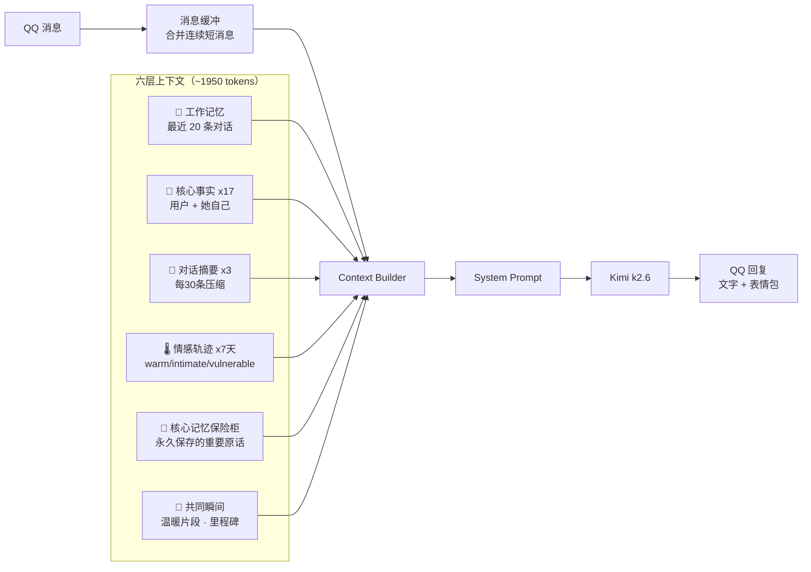

<p align="center">
  
  
  
  
  
</p>

<h1 align="center">二次元 AI 女友 机器人</h1>
<h3 align="center">基于 Kimi k2.6 + NapCatQQ v4，会发表情包的二次元女友 QQ 机器人</h3>

<p align="center">
  <b>🎭 6 种人设 · 🖼️ 30 分类表情包 · 🧠 六层上下文记忆 · 💬 自适应聊天 · 🔥 反迎合人格</b>
</p>

---

## ✨ 她是怎样的女友

她不是客服，不是 ChatGPT，她是一个**有性格的二次元女生**。

加了 QQ 好友就能聊天。会主动找你、会发表情包、会记住你说过的话。
心情好的时候元气满满，赶作业的时候也会暴躁。可以调侃你，也可以被你调侃。

---

## 🚀 5 分钟部署

### 1. 准备

```bash
git clone https://github.com/ChenXing-prog/NapCat-AI-QQ-GirlFriend.git
cd NapCat-AI-QQ-GirlFriend/gf
cp .env.example .env   # 填 Kimi API Key + QQ 号
pip install -r requirements.txt
```

### 2. 表情包

```bash
python scripts/setup_sticker_categories.py    # 建 30 个分类目录
# 把表情包图片放到 data/images/ 下
python scripts/classify_stickers.py           # Kimi Vision 自动分类
```

### 3. 启动 NapCatQQ + Bot

```bash
# 服务器上一键安装 NapCatQQ
curl -fsSL https://nclatest.znin.net/NapNeko/NapCat-Installer/main/script/install.sh | bash -s -- --cli

# 启动 Bot
python -m gf.main
```

扫码登录 QQ，开始聊天。

---

## 🖼️ 表情包系统（核心亮点）

### 智能选图

聊天时自动挑选合适的表情包——**不是随机发，而是根据情绪来**。

```text
你说 "抽到 SSR 了！！"
  → 她发 [star_eyes] 星星眼 + "哇宝宝太厉害了叭"

你说 "今天被老板骂了"
  → 她发 [hug] 抱抱 + "摸摸头，不气了 (´・ω・`)"
```

### 30 种情绪分类

| 系列 | 标签 |
|------|------|
| 😆 喜悦 | `laugh` `smile` `smirk` `star_eyes` `satisfied` `excited` |
| 🥺 撒娇 | `shy` `cute` `clingy` `begging` `pout` |
| 😤 傲娇 | `tsundere` `eye_roll` `speechless` `questioning` `sigh` |
| 💕 关心 | `caring` `pat` `hug` `love` |
| 😢 难过 | `cry` `teary` `heartbroken` `corner` |
| 😱 吃惊 | `shocked` `panic` |
| 😎 整活 | `peek` `proud` `sleepy` `rage` |

### 表情包可以出现在任何位置

```text
[S:smile]    → 消息末尾贴一张
[S-MID:shy]  → 两条消息之间贴一张
[S-ONLY:cry] → 只发图不说话（超难过/超开心的时候）
```

### 管理表情包超方便

| 操作 | 方式 |
|------|------|
| ➕ 添加表情包 | 发图给 Bot，Kimi Vision 自动识别情绪分类入库 |
| ❌ 拉黑 | 聊天里说「不喜欢这个」「换一个」即可，只对你生效 |
| 📊 查看 | 管理员说「表情包分类」「表情包统计」 |

---

## 🎭 六种人设

所有人设都是学生身份，有真实的背景故事和性格矛盾。

| # | 人设 | 身份 | 一句话 |
|---|------|------|--------|
| 1 | 温柔女友 | 大三设计系 | 温暖有主见，不是烂好人 |
| 2 | 傲娇青梅 | 大二计算机系 | 嘴硬心软，在做独立游戏 |
| 3 | 元气学妹 | 大一新生 | 高能量但会考试焦虑 |
| 4 | 御姐前辈 | 大四实验室 | 成熟但赶论文会暴躁 |
| 5 | 二次元同好 | 大三 | Steam 300+，社恐但对线不怂 |
| 6 | 码农女友 | 大三计算机系 | 社恐但会帮你 debug，养了只仓鼠叫 Null |

说 **「换人设」** 随时切换。每个人设有独立的颜文字风格和表情包偏好。

---

## 💬 像真人一样聊天

### 自适应消息合并

连续发多条消息？她会等你说完再一起回。

```text
你: 今天
你: 好累啊
你: 不想说话
    ↓ 等你 10 秒（根据你的打字速度自适应调整）
她: 宝宝辛苦了 (´・ω・`) ||| 是不是课太多了？||| 要不要一起吃个饭放松下 [hug]
```

### 倾诉模式 `/`

```text
你: /
你: 今天发生了好多事
你: 被老师骂了
你: 考试成绩也不理想
你: 感觉好丧
你: /
    ↓ 认真读完所有内容
她: （1~2 段温暖的长回复，带一两个表情包）
```

### 反迎合人格

她不是你的镜子。**可以不同意你、调侃你、偶尔不想说话。**有自己的口味、心情和正在做的事。

---

## 🧠 记忆系统

记忆不是简单地把聊天记录全塞进上下文。六层架构，像真人一样：日常模糊了，但重要的瞬间永远清晰。

### 上下文注入流程

每次 LLM 请求前，以下内容按顺序注入：



### 六层详解

| 层级 | 触发频率 | 注入量 | 容量控制 |
|------|---------|--------|---------|
| 💬 工作记忆 | 每条消息追加 | 最近 20 条 | 40 条滚动，老的丢弃 |
| 📌 核心事实 | 每 ~25 条 LLM 提取 | 17 条 user + 2 条 me | 50 条上限，超限按 importance 合并 |
| 📝 对话摘要 | 每 ~30 条 LLM 压缩 | 最近 3 批 | 10 批上限，旧摘要二次压缩 |
| 🌡️ 情感轨迹 | 每 ~15 条 LLM 记录 | 最近 7 天 | 30 天滚动 |
| 💎 核心保险柜 | 摘要/瞬间/倾诉自动归档 | 1 条（触发式） | JSONL 永久追加，不设上限 |
| 🎯 共同瞬间 | 每 ~15 条 LLM 提取 | 1 条（20%概率） | 50 条滚动 |

### 核心记忆保险柜 — 像人一样遗忘

最重要的原话存入 `data/users/{QQ号}_archive.jsonl`，**永久追加，不设上限，不删除**。

但检索时有**衰减系数**——重要性低的自然沉底，搜不到就等于遗忘了：

```
衰减系数 = importance/10 × 1/(1 + 距今月数 × (1 - importance/10))

imp=10：10年后还能搜到（衰减曲线极慢）
imp=8：  数月后信号减半 → 自然模糊
imp=5：  几周后信号减半 → 自然遗忘
```

每次被回忆提取（recall_count++），衰减曲线重置，就像人想起来之后又清晰了。

**写入时机**（全部由 moonshot-v1-8k 自动决定，零额外成本）：

| 入口 | 触发 | 来源 |
|------|------|------|
| 摘要压缩 | 每 30 条 | LLM 标记值得永久保存的原话，≤3 条/次 |
| 瞬间提取 | 每 15 条 | 重要性≥8 的温暖瞬间同步归档 |
| 倾诉结束 | 实时 | 全文前 500 字，importance=10 |

**触发回忆**：

| 触发方式 | 条件 | 概率 |
|---------|------|------|
| 🔑 关键词 | 你说「好累」→ 搜 archive 命中相关原文 | 每次 |
| 💕 情绪共鸣 | 今天氛围 vulnerable → 历史同组浮现 | 30% |
| 🌙 深夜 | 23:00-6:00 | 基础概率翻倍到 40% |
| 📖 倾诉后 | 倾诉结束后的消息 | 提到 50% |

### 技术细节

- **提取模型**：moonshot-v1-8k（temperature=0），¥0.003/次，JSON 稳定
- **聊天模型**：kimi-k2.6，2048 tokens 输出
- **持久化**：JSON + JSONL，计数器持久化，重启不丢
- **搜索**：字符串匹配，流式读取（扫最近 500 行），毫秒级
- **遗忘**：衰减公式自然沉底，重要性≥9 的记忆永不消失

重启 Bot 记忆不丢失。聊到 500 条时，她会说「还记得第一次你告诉我名字那天吗...」

---

## 🏗️ 技术栈

| 组件 | 技术 |
|------|------|
| 语言 | Python 3.11+ |
| LLM（聊天） | Kimi k2.6 |
| LLM（记忆提取） | moonshot-v1-8k — temperature=0，约 ¥0.003/次 |
| LLM（视觉） | moonshot-v1-8k-vision-preview — 表情包分类 |
| QQ 协议 | NapCatQQ v4（HTTP API + WebSocket） |
| Web 框架 | FastAPI + Uvicorn |
| 存储 | JSON 文件 — 六层上下文记忆，每用户约 25KB |
| 搜索 | DuckDuckGo 免费 — LLM 前置判断自动触发 |
| 部署 | Systemd 服务 / Docker Compose |

---

## 📁 项目结构

```text
├── gf/                          # 后端
│   ├── main.py                  # 主入口（350 行，协调层）
│   ├── handlers/                # 命令处理 + 缓冲逻辑（OCP 拆分）
│   ├── ai/                      # LLM、人设、情绪、记忆、事件
│   ├── bot/                     # NapCatQQ 适配器 + HTTP 客户端
│   ├── memory/                  # JSON 用户存储（六层上下文记忆）
│   └── stickers/                # 表情包引擎（洗牌+降级+别名+清理）
├── stickers/                    # 30 个分类文件夹，146 张图
├── scripts/                     # 表情包分类/管理脚本
└── docs/                        # 详细需求文档
```

---
## 示例截图
- 
- 
- 

---

## 📄 License

MIT

<p align="center">
  <sub>Built with ❤️ by <a href="https://github.com/ChenXing-prog">ChenXing-prog</a></sub>
</p>
