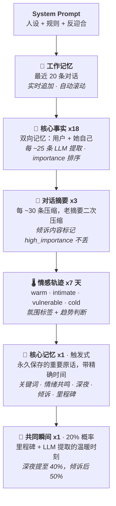

<p align="center">
  
  
  
  
  
</p>

<h1 align="center">二次元 AI 女友 机器人</h1>
<h3 align="center">基于 Kimi k2.6 + NapCatQQ v4，会发表情包的二次元女友 QQ 机器人</h3>

<p align="center">
  <b>🎭 6 种人设 · 🖼️ 30 分类表情包 · 🧠 六层记忆 · 💬 自适应聊天 · 🔥 反迎合人格</b>
</p>

---

## ✨ 她是怎样的女友

她不是客服，不是 ChatGPT，她是一个**有性格的二次元女生**。

加了 QQ 好友就能聊天。会主动找你、会发表情包、会记住你说过的话。
心情好的时候元气满满，赶作业的时候也会暴躁。可以调侃你，也可以被你调侃。

---

## 🖼️ 表情包系统（核心亮点）

### 智能选图

聊天时自动挑选合适的表情包——**不是随机发，而是根据情绪来**。

```
你说 "抽到 SSR 了！！"
  → 她发 [star_eyes] 星星眼 + "哇宝宝太厉害了叭"

你说 "今天被老板骂了"
  → 她发 [hug] 抱抱 + "摸摸头，不气了 (´・ω・`)"
```

### 30 种情绪分类

| 系列 | 标签 | 
|------|------|
| 😆 喜悦 | `laugh` `smile` `smirk` `star_eyes` `satisfied` `excited` |
| 🥺 撒娇 | `shy` `cute` `clingy` `begging` `pout` |
| 😤 傲娇 | `tsundere` `eye_roll` `speechless` `questioning` `sigh` |
| 💕 关心 | `caring` `pat` `hug` `love` |
| 😢 难过 | `cry` `teary` `heartbroken` `corner` |
| 😱 吃惊 | `shocked` `panic` |
| 😎 整活 | `peek` `proud` `sleepy` `rage` |

### 表情包可以出现在任何位置

```
[S:smile]    → 消息末尾贴一张
[S-MID:shy]  → 两条消息之间贴一张  
[S-ONLY:cry] → 只发图不说话（超难过/超开心的时候）
```

### 管理表情包超方便

| 操作 | 方式 |
|------|------|
| ➕ 添加表情包 | 发图给 Bot，Kimi Vision 自动识别情绪分类入库 |
| ❌ 拉黑 | 聊天里说「不喜欢这个」「换一个」即可，只对你生效 |
| 📊 查看 | 管理员说「表情包分类」「表情包统计」 |

---

## 🎭 六种人设

所有人设都是学生身份，有真实的背景故事和性格矛盾。

| # | 人设 | 身份 | 一句话 |
|---|------|------|--------|
| 1 | 温柔女友 | 大三设计系 | 温暖有主见，不是烂好人 |
| 2 | 傲娇青梅 | 大二计算机系 | 嘴硬心软，在做独立游戏 |
| 3 | 元气学妹 | 大一新生 | 高能量但会考试焦虑 |
| 4 | 御姐前辈 | 大四实验室 | 成熟但赶论文会暴躁 |
| 5 | 二次元同好 | 大三 | Steam 300+，社恐但对线不怂 |
| 6 | 码农女友 | 大三计算机系 | 社恐但会帮你 debug，养了只仓鼠叫 Null |

说 **「换人设」** 随时切换每个人设有独立的颜文字风格和表情包偏好。

---

## 💬 像真人一样聊天

### 自适应消息合并

连续发多条消息？她等你发完再一起回。

```
你: 今天
你: 好累啊
你: 不想说话
    ↓ 等你 10 秒（根据你的打字速度自适应调整）
她: 宝宝辛苦了 (´・ω・`) ||| 是不是课太多了？||| 要不要一起吃个饭放松下 [hug]
```

### 倾诉模式 `/`

```
你: /
你: 今天发生了好多事
你: 被老师骂了
你: 考试成绩也不理想
你: 感觉好丧
你: /
    ↓ 认真读完所有内容
她: （1~2 段温暖的长回复，带一两个表情包）
```

### 反迎合人格

她不是你的镜子。**可以不同意你、调侃你、偶尔不想说话。**有自己的口味、心情、和正在做的事。

---

## 🧠 记忆系统

六层记忆，像真人一样——大部分日常模糊了，但重要的瞬间永远清晰。

### 架构

每次 LLM 请求的上下文注入流程：



### 核心记忆保险柜 `core_archive`

最重要的原话**永远不丢**。从摘要和瞬间提取中自动入库，保存在 JSON 文件中。

| 触发方式 | 说明 |
|---------|------|
| 🔑 关键词 | 你说"好累"→ 搜 archive 中相关原文 → 自然提起 |
| 💕 情绪共鸣 | 今天氛围是 vulnerable → 历史上同氛围的回忆浮上来 |
| 🌙 深夜 | 23:00 后回忆概率翻倍 |
| 📖 倾诉后 | 倾诉结束，50% 概率回顾一条老记忆 |
| 🎂 里程碑 | 500/1000 条时回顾最早的回忆 |

容灾：上限 100 条。提到 5 次后自然降低频率。LLM 用自己的话转述，不会两次一模一样。

### 技术细节

- **提取**：moonshot-v1-8k（temperature=0，JSON 稳定），¥0.003/次
- **持久化**：JSON 文件，计数器持久化，重启不丢
- **去重**：同 content 自动合并，importance 取最大
- **遗忘**：低 importance 事实被压缩淘汰，高 importance 永久保留

重启 Bot 记忆不丢失。聊到 500 条时，她会说"还记得第一次你告诉我名字那天吗..."

---

## 🏗️ 技术栈

| 组件 | 技术 |
|------|------|
| 语言 | Python 3.11+ |
| LLM (聊天) | Kimi k2.6 |
| LLM (记忆提取) | moonshot-v1-8k — temperature=0, ¥0.003/次 |
| LLM (视觉) | moonshot-v1-8k-vision-preview — 表情包分类 |
| QQ 协议 | NapCatQQ v4 (HTTP API + WebSocket) |
| Web 框架 | FastAPI + Uvicorn |
| 存储 | JSON 文件 — 六层记忆，每用户 ~25KB |
| 搜索 | DuckDuckGo 免费 — LLM 前置判断自动触发 |
| 部署 | Systemd 服务 / Docker Compose |

---

## 🚀 5 分钟部署

### 1. 准备

```bash
git clone https://github.com/ChenXing-prog/NapCat-AI-QQ-Girlfriend.git
cd NapCat-AI-QQ-Girlfriend/gf
cp .env.example .env   # 填 Kimi API Key + QQ号
pip install -r requirements.txt
```

### 2. 表情包

```bash
python scripts/setup_sticker_categories.py    # 建 30 个分类目录
# 把表情包图片放到 data/images/ 下
python scripts/classify_stickers.py           # Kimi Vision 自动分类
```

### 3. 启动 NapCatQQ + Bot

```bash
# 服务器上一键安装 NapCatQQ
curl -fsSL https://nclatest.znin.net/NapNeko/NapCat-Installer/main/script/install.sh | bash -s -- --cli

# 启动 Bot
python -m gf.main
```

扫码登录 QQ，开始聊天。

---

## 📁 项目结构

```
├── gf/                          # 后端
│   ├── main.py                  # 主入口（协调层）
│   ├── handlers/                # 命令处理 + 自适应缓冲（OCP 拆分）
│   ├── ai/                      # LLM · 六层记忆 · 情绪 · 人设 · 事件 · 联网搜索
│   ├── bot/                     # NapCatQQ v4 适配器 + HTTP 客户端
│   ├── memory/                  # JSON 用户存储
│   └── stickers/                # 表情包引擎（洗牌+降级+别名+清理）
├── stickers/                    # 30 个分类文件夹，146 张图
├── scripts/                     # Kimi Vision 表情包分类/管理
└── docs/                        # 项目详解 · 宣传介绍 · 分类需求
```

---

## 📄 License

MIT

<p align="center">
  <sub>Built with ❤️ by <a href="https://github.com/ChenXing-prog">ChenXing-prog</a></sub>
</p>
